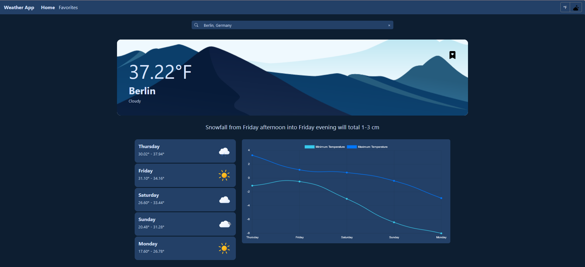

# Weather App

This is a simple, responsive web app built with React that allows users to check the weather for a specific city, save their favorite cities. The app utilizes the AccuWeather API for weather data.

 Demo available on [GitHub Pages.](https://shakedva.github.io/Shaked-Vaknin-31-12-2023/)

## Pages

1. Weather Page:  Display weather information for a searched city.
2. Favorites Page: Show a list of saved favorite cities. Users can add and remove cities from their favorites locally.

## Features

1. Geolocation API Integration: The app uses the Geolocation API to set the default location based on the user's device coordinates.
2. Temperature Unit Toggle: Users can switch between Celsius and Fahrenheit
3. Dark/Light Theme Support

## Screenshots

